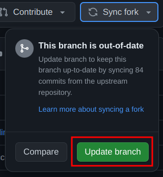

# Contributing

Contributions are always welcome, no matter how large or small!

We want this community to be friendly and respectful to each other. Please follow it in all your interactions with the project. Before contributing, please read the [code of conduct](./CODE_OF_CONDUCT.md).

## Table of Contents

- [Setting up your local clone](#setting-up-your-local-clone)
- [How to locally Run](#how-to-locally-run)
  - [Download Dependencies](#download-dependencies)
  - [Development Build](#development-build)
  - [Production Build](#production-build)
- [How to Contribute](#how-to-contribute)
  - [Working on Issue](#working-on-an-issue)
  - [Opening Pull Request](#opening-a-pull-request)

### Setting Up Your Local Clone

Before you begin working on anything, make sure you follow these steps in order to set up a clone on your local machine:

1. Clone the repo in your local environment. If you don't know how to do so, follow the GitHub documentation on how to [fork a repo](https://docs.github.com/en/get-started/quickstart/fork-a-repo).

1. Clone the forked repo to your local machine with one of the commands below. You can also read the GitHub documentation on [cloning a repository](https://docs.github.com/en/repositories/creating-and-managing-repositories/cloning-a-repository).

    ```bash
    # If you have SSH set up with Git:
    git clone git@github.com:nativeflowteam/documentation.git
    # Otherwise for HTTPS:
    git clone https://github.com/nativeflowteam/documentation.git
    ```

1. `cd` into the directory of your local clone, remember to always pull the `main` branch before you branch out from it to continue working on other sections' respective branches.

### How to locally Run

Run a [localhost:3000](http://localhost:3000/) server to test out the changes / updates made by you before submitting a Pull Request.

#### Download Dependencies

The project relies on various external libraries and modules to function properly.  These are typically managed using Node Package Manager (npm).

```bash
# Incase you forgot to change your dir
cd documentation
npm i
```

#### Development Build

Run the development build which is optimized for development and debugging.

```bash
npm run start
```

### Production Build

Run the prod build which is optimized for performance and is intended for deployment to a live environment. The code in build files is minified, thus making it unreadable to maintain small build size and secure.

```bash
npm run build
npm run serve
```

### How to Contribute

#### Working on an Issue

Once you have the repo cloned, and the local environment has been set, you can begin working on your issue:

1. Create a new branch, replacing the `<your branch name>` with an actual branch name that briefly explains the purpose of the branch in some way:

    ```bash
    git checkout -b <your branch name>

    # Some examples:
    git checkout -b docs_update
    git checkout -b shadow_nits
    git checkout -b link_update
    ```

1. Add commits as you work on your issue, replacing the `<your commit message>` text with your actual commit message:

   ```bash
   git commit -m "<your commit message>" -m "<optional brief explanation about your commit>"

   # An example:
   git commit -m "Update README file" -m "Add how-to build from source"
   ```

1. Sync your local environment every often so that you don't lose on any newer progress.
    - Firstly sync your fork with the latest added commits using GitHub GUI.

      

    - Then pull those changes into your cloned repository.

        ```bash
        git pull
        ```

1. Push your branch to our repo, replacing the `<your branch name>` with the branch you've been working on locally:

    ```bash
    git push origin <your branch name>

    # An example:
    git push origin size_fix
    ```

#### Opening a Pull Request

1. After pushing your changes, go to our repo on GitHub and click the "Compare & pull request" button. If you have multiple of these buttons, be sure you click the one for the correct branch.
   - If you don't see this button, you can click the branch dropdown menu and then select the branch you just pushed from your local clone:

      
   - Once you have switched to the correct branch on GitHub, click the "Contribute" dropdown and click the "Open pull request" button.

1. Fill the PR template summarising all new additions to your repositories, don't directly merge without a review by maintainers.

1. After your PR has been merged, delete it on the repo, just below the merged notification in the PR, there's an option to delete it, also delete that branch in your local environment and checkout to main to pull the updates.

    ```bash
    git branch -D branch_name
    git checkout main && git pull # pull only works if you synced your fork with main repo
    ```

**Thanks for contributing to our repo, Happy Coding <3 !**
